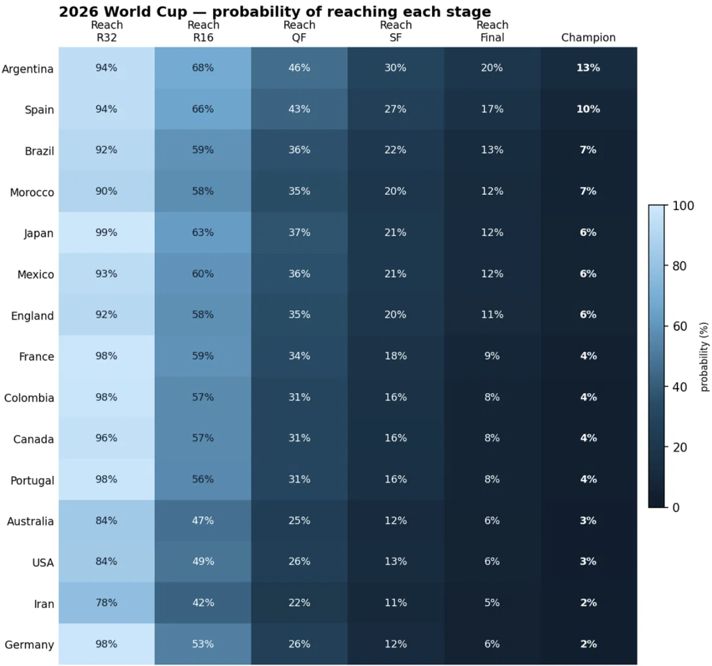
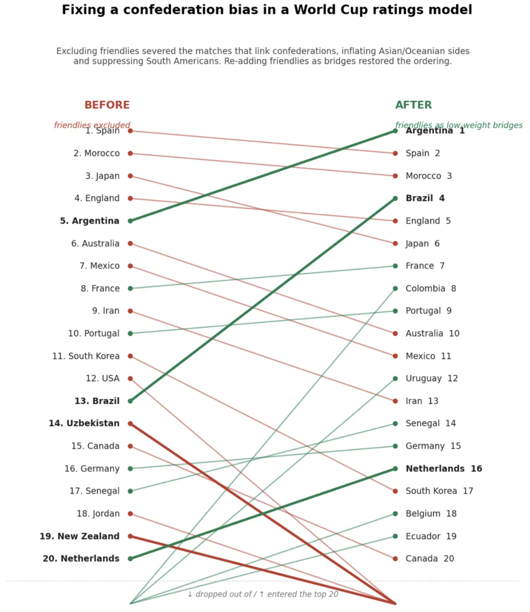

# Predicting the 2026 FIFA World Cup with a Monte Carlo Simulation

A statistical model that forecasts the 2026 FIFA World Cup by fitting a **Dixon–Coles**
goal model to historical international results and simulating the full 48-team
tournament tens of thousands of times.

The interesting part of this project isn't the prediction — it's the debugging. The
first version of the model ranked New Zealand above the Netherlands and put Brazil
13th. This repo documents how that bias was found, diagnosed, fixed, and then
*validated* against past tournaments, rather than just trusted because the output
looked plausible.

---

## Headline forecast

| Rank | Team | Title probability |
|----:|------|:-----:|
| 1 | Argentina | 12.7% |
| 2 | Spain | 10.3% |
| 3 | Brazil | 7.4% |
| 4 | Morocco | 6.9% |
| 5 | Japan | 6.4% |
| 6 | England | 6.3% |
| 7 | France | 4.8% |
| 8 | Portugal | 4.1% |

*Top 8 of 48; the model prints the full table and every team's chance of reaching
each stage.*



Each row is a team; each column a stage from "qualify" (left) to "champion" (right).
The colour funnels dark as you move right — even the favourites shed probability at
every knockout round.

---

## The bug worth talking about

International ratings models have a well-known weak point: **the confederations are
only weakly connected.** Competitive matches (qualifiers, continental cups) are played
almost entirely *within* a confederation, so a model fit on them alone has no reliable
way to compare, say, an Asian side against a European one.

My first model excluded friendlies on purpose — they're noisy, since teams rest
players and experiment. But friendlies are the main matches that *bridge* confederations.
Removing them left the model with six poorly-connected islands: teams that thrash weak
regional opponents floated to the top (New Zealand, Uzbekistan, Asian sides), while
South America — an all-strong gauntlet where even Brazil drops points — sank.

**The fix:** keep friendlies, but at a low weight — enough to link the confederations
without letting their noise dominate. The ordering snapped back into place.



This is documented end-to-end in [METHODOLOGY.md](METHODOLOGY.md).

---

## How it works (short version)

- **Match model:** Dixon–Coles — team-specific attack/defence parameters plus a
  low-score dependence correction, fit by weighted maximum likelihood on competitive
  international matches.
- **Weighting:** each match is weighted by recency (exponential time decay) × competition
  importance (World Cup > continental finals > qualifiers > friendlies-as-bridges).
- **Prior:** a self-computed Elo rating acts as a Gaussian prior, so debutants and
  data-thin teams shrink toward a sensible strength instead of producing garbage.
- **Tournament:** the full 48-team format — 12 groups of four, top two plus the eight
  best third-placed teams into a Round of 32, then knockouts with extra time and
  penalties — simulated 20,000+ times.
- **Validation:** the model is backtested against the 2018 and 2022 World Cups with
  strict no-leakage refitting, scored with proper metrics against baselines, and checked
  for calibration.

---

## Quickstart

```python
# 1. Upload results.csv (Kaggle "International football results from 1872 to present")
# 2. Paste worldcup_2026_model.py into a Colab cell and run it.
#    It fits the model and prints the 2026 forecast automatically.

# 3. In a new cell:
res = run_monte_carlo(params)     # the forecast DataFrame
plot_stage_heatmap(res)           # the stage-probability heatmap

# 4. Validation (each refits the model, takes a few minutes):
backtest_matches()                # match-level RPS / log-loss vs baselines
backtest_stages()                 # stage-level calibration on 2018 & 2022
sweep_friendly_weight(2018)       # tune a hyperparameter on ONE tournament
```

Everything is in a single file — no imports to manage. All dependencies (NumPy, SciPy,
pandas, Matplotlib) are preinstalled in Google Colab.

**Before trusting the numbers:** fill the three play-off placeholders in `GROUPS_2026`
and make team names match your dataset (the model prints any it can't find).

---

## Data

[International football results from 1872 to present](https://www.kaggle.com/datasets/martj42/international-football-results-from-1872-to-present)
(Kaggle) — every international match with scores, competition type, and venue. The
`tournament` column drives the competition weighting; `neutral` controls home advantage.

---

## Results & validation

The model was backtested on the 2018 and 2022 World Cups with strict no-leakage
refitting — fit only on data before each tournament's kickoff, never touching future
results.

### Match-level (64 matches per tournament)

| | Model RPS | Elo RPS | Base-rate RPS | ECE |
|---|:---:|:---:|:---:|:---:|
| **2018** | **0.2196** | 0.2280 | 0.2434 | 0.064 |
| **2022** | **0.2253** | 0.2204 | 0.2340 | 0.019 |

Lower RPS is better. The model beats the base-rate comfortably in both years and beats
Elo in 2018. In 2022 it trails Elo by a small margin (0.005) — within the expected range
for 64 matches and consistent with the rule of thumb: "land near, not necessarily beat,
Elo." Both ECE values are low, confirming the probabilities are well-calibrated.

### Stage-level (champion rank)

- **2018:** France was ranked **#6** in pre-tournament title probability (4.5%). Predicted
  top 4: Brazil 22.0%, Argentina 11.9%, Germany 10.4%, Spain 10.2%. France's low rank
  reflects the known limitation of scoreline-based models underrating talent-rich sides.
- **2022:** Argentina was ranked **#2** in pre-tournament title probability (11.4%) —
  and won it. Predicted top 4: Brazil 27.2%, **Argentina 11.4%**, Spain 6.0%, Portugal 5.4%.

### Engine calibration (pooled across both tournaments)

| Predicted band | Mean predicted | Actual frequency |
|:---:|:---:|:---:|
| 0.0 – 0.2 | 0.07 | 0.08 |
| 0.2 – 0.4 | 0.30 | 0.22 |
| 0.4 – 0.6 | 0.49 | 0.48 |
| 0.6 – 0.8 | 0.67 | 0.76 |
| 0.8 – 1.0 | 0.86 | 1.00 |

**Brier score: 0.1108 · ECE: 0.027** — predicted probabilities track actual frequencies
closely across all bands, confirming the simulation engine propagates probabilities
correctly.

Compared against the betting market, the model recovers the broad shape (Argentina,
Spain, and Brazil among the favourites) while diverging in the ways noted below.

---

## Known limitations

- **It underrates talent-rich, low-scoring sides** (France is the clearest case). A
  model that only sees scorelines cannot price the squad quality that the market does.
  The principled fix is a squad-value or market-odds prior — a planned extension.
- **A mild residual confederation lean remains** — Asian sides sit slightly high. The
  friendly weight is a tunable hyperparameter; raising it or swapping in an external
  Elo prior reduces this further.
- **The Round-of-32 bracket is a strength-seeded approximation** of FIFA's exact
  positional template and 495-combination third-place matrix. This affects individual
  paths but has only a second-order effect on title probabilities.
- **Stage-level calibration rests on two tournaments**, so it is directional rather
  than definitive.

---

## Possible extensions

- A squad-value prior (Transfermarkt) or a market-odds blend to fix the France-type gap.
- The exact FIFA third-place matrix for a fully faithful bracket.
- Live in-tournament updating as group results come in.
- A Streamlit front end to tweak assumptions interactively.

---

## Tech stack

Python · NumPy · SciPy · pandas · Matplotlib · Google Colab

## References

- Dixon, M. & Coles, S. (1997). *Modelling Association Football Scores and Inefficiencies
  in the Football Betting Market.* Journal of the Royal Statistical Society: Series C.
- Maher, M. J. (1982). *Modelling Association Football Scores.* Statistica Neerlandica.
